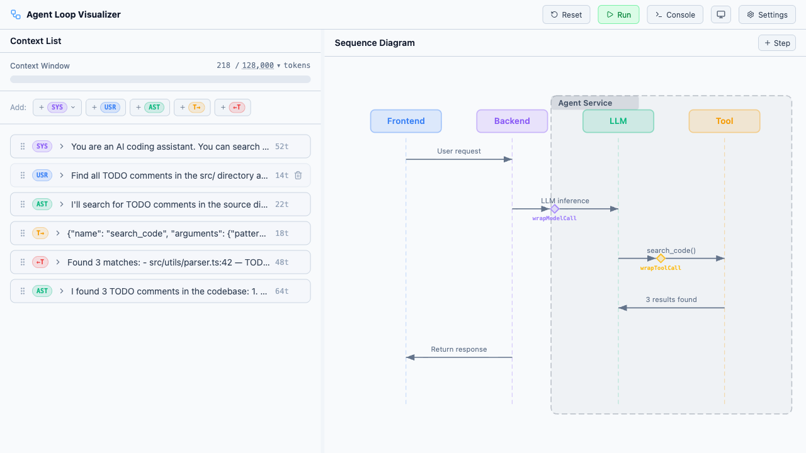
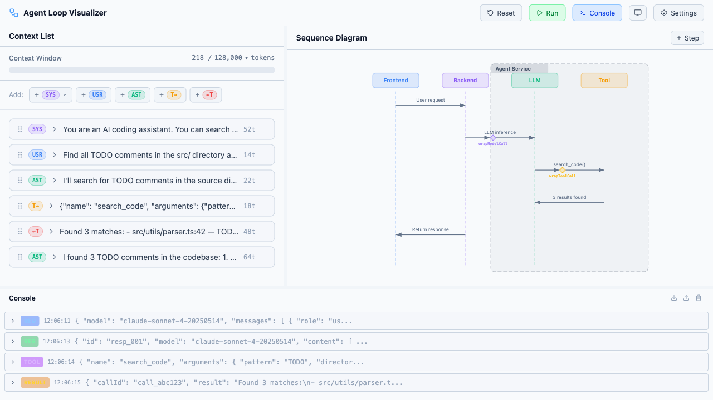
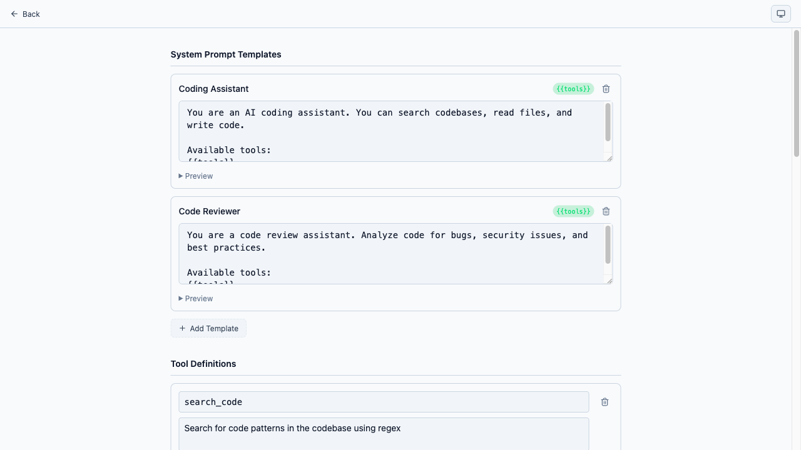
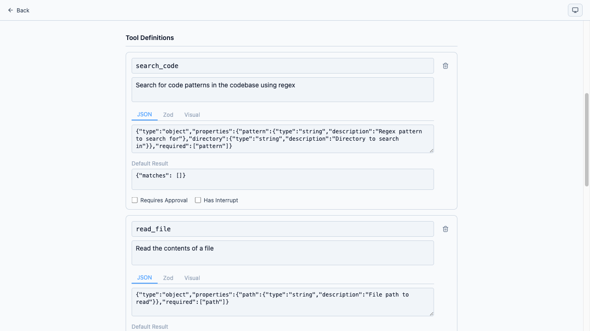
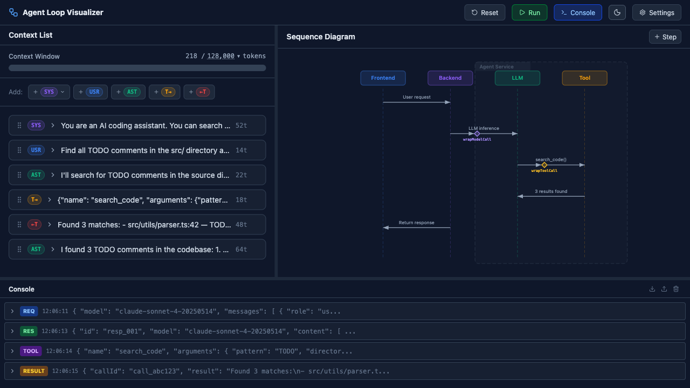

# Agent Loop Visualizer

> **⚠️ Disclaimer:** This is a side project that was entirely vibe coded — not a single line of code has been manually reviewed. The project is under active development and may be buggy. Use at your own risk!

A web-based tool for visualizing and debugging AI agent execution flows. Designed for inspecting the complete lifecycle of an agent loop — context management, tool calls, message exchanges, and more.

## Screenshots

### Main Visualizer

The split-pane layout with the **Context Window** on the left (showing messages with token counts) and the **Sequence Diagram** on the right (visualizing the agent execution flow with actors and interactions).



### Console Panel

The bottom **Console Panel** shows raw JSON logs for each LLM request/response and tool call/result, useful for debugging agent execution in real time.



### Settings — System Prompts & Tool Definitions

Configure **System Prompt Templates** with variable support (`{{tools}}`) and define **Tool Definitions** with JSON Schema, Zod code, or a visual builder.





### Dark Mode

Full dark theme support across all panels.



## Features

- **Context Window Panel** — Manage messages in the agent context (system prompts, user messages, assistant responses, tool calls, tool results) with drag-and-drop reordering and token usage tracking
- **Sequence Diagram Panel** — Visual representation of agent execution as a sequence diagram with actors, interactions, and step editing
- **Console Panel** — Raw JSON output viewer for debugging agent execution
- **Settings** — System prompt templates, tool definitions with JSON Schema / Zod editor, LLM connector configuration, and data export/import

## Tech Stack

React 19, TypeScript, Vite, Tailwind CSS v4, Zustand, Zod, react-router v7

## Getting Started

```bash
pnpm install
pnpm dev
```

## License

[Apache License 2.0](LICENSE)
